 ``` mermaid
flowchart TD
    A["The Grand Magic of Division<br/>The Sharing Charm"] --> B{"How does the charm work?"}

    B --> C["The Magical Ingredients"]
    B --> D["The Incantation Process"]

    subgraph C [The Magical Ingredients]
        C1["The Treasure Pouch<br/>Dividend"]
        C2["The Gathering of Friends<br/>Divisor"]
        C3["Each Friend's Fair Share<br/>Quotient"]
        C4["The Leftover Pixie Dust<br/>Remainder"]
    end

    subgraph D [The Incantation Process]
        D1["1. Pour out the treasure."] --> D2{"2. Can you give one<br/>to every friend?"}
        D2 -- "Yes" --> D3["3. Pass one out to each."]
        D2 -- "No" --> D4["The sharing is complete<br/>What's left is Remainder"]
        D3 --> D2
    end

    C --> E
    D --> E

    subgraph E [The Magical Result]
        E1["Perfect Sharing"]
        E2["Sharing with Remainder"]
    end

    E1 --> F1["Example: 9 Galleons ÷ 3 = 3<br/>No gold left over"]
    E2 --> F2["Example: 8 Chocolate Frogs ÷ 3 = 2 R2"]

```
Of course! Let me explain these magical number relationships like Professor Flitwick would, then create a proper Mermaid diagram.

***

### **The Great Hall of Number Magic**

**Professor Flitwick:** *"Gather 'round, first-years! Today we learn the deepest secrets of number magic - how the four great spells are actually family!"*

#### **Division & Subtraction: The Sharing Spell's Secret**

*"Imagine you have 12 Chocolate Frogs and 3 hungry friends. The Sharing Spell (division) asks: 'How many does each get?'*

*But watch closely! The secret is: **Division is just repeated Subtraction!**"*

*"We start with 12 Frogs. We subtract 3 (one for each friend). *12 - 3 = 9*  
We subtract 3 again. *9 - 3 = 6*  
Again! *6 - 3 = 3*  
One last time! *3 - 3 = 0*"*

*"We subtracted 3 Frogs **4 times**! So 12 ÷ 3 = 4!  
Division is simply counting how many times you can subtract the same number until you reach zero!"*

#### **Multiplication & Addition: The Duplication Charm's Secret**

*"Now, the Duplication Charm (multiplication)! If each of your 3 friends has 4 Frogs, how many total?*

*The secret: **Multiplication is just repeated Addition!**"*

*"We add 4 + 4 + 4 = 12!  
We added 4 **3 times**! So 4 × 3 = 12!  
Multiplication is simply adding the same number over and over!"*

#### **The Great Family Revelation**

*"Now for the grand magic! These four spells are two pairs of opposite twins!"*

*"**Addition and Subtraction** are opposites - whatever one does, the other undoes!  
If you add 3 Galleons then subtract 3, you're back where you started!"*

*"**Multiplication and Division** are opposites too!  
If you triple your Galleons then divide by three, you're back to your original pile!"*

*"And here's the family tree:  
- Multiplication is **repeated Addition**  
- Division is **repeated Subtraction**  
They're all part of the same magical family!"*

***

### **The Magical Number Family Tree**

```mermaid
---
config:
  flowchart:
    direction: TD
    nodeSpacing: 75
    rankSpacing: 75
    useMaxWidth: false
---
flowchart TD
    A[“The Four Great Number Spells<br/>All Part of One Magical Family”] --> B
    
    subgraph B [The Spell Relationships]
        B1[“Addition Charm<br/>Putting numbers together”]
        B2[“Subtraction Charm<br/>Taking numbers apart”]
        B3[“Multiplication Charm<br/>Quick duplication”]
        B4[“Division Charm<br/>Fair sharing”]
    end

    B1 --> C1[“OPPOSITE SPELLS<br/>They undo each other's magic”]
    B2 --> C1
    
    B3 --> C2[“OPPOSITE SPELLS<br/>They reverse each other's effects”]
    B4 --> C2

    B1 --> D1[“Multiplication is really<br/>SECRET ADDITION repeated many times”]
    B3 --> D1
    
    B2 --> D2[“Division is really<br/>SECRET SUBTRACTION repeated until zero”]
    B4 --> D2

    C1 --> E[“Example: 5 + 3 = 8 then 8 - 3 = 5<br/>You're back where you started!”]
    C2 --> F[“Example: 4 × 3 = 12 then 12 ÷ 3 = 4<br/>The magic is reversed!”]
    D1 --> G[“Example: 4 × 3 = 4 + 4 + 4 = 12<br/>Adding four three times!”]
    D2 --> H[“Example: 12 ÷ 3 = count subtractions of 3<br/>12-3=9, 9-3=6, 6-3=3, 3-3=0 → 4 times!”]
```



### **Why This Magic Works Every Time**

The diagram shows the beautiful relationships:

- **Top**: All four operations are connected
- **Middle**: 
  - Addition & Subtraction are opposites (undo each other)
  - Multiplication & Division are opposites (reverse each other)  
  - Multiplication is built from repeated Addition
  - Division is built from repeated Subtraction
- **Bottom**: Concrete examples showing the magic in action

*"Remember, young wizards: all number magic is connected. Once you know one spell, you're already learning the others! Now, who wants to practice with some actual Chocolate Frogs?"* 🐸✨

### **The Magical Mystery of Fractions: Uncomfortable Parts Explained**

**Professor Flitwick:** *"Gather 'round, young witches and wizards! Today we conquer the mysterious art of Fractions - the magic that makes one whole thing into many parts!"*

#### **The Uncomfortable Truths About Fractions**

*"I know fractions can feel tricky, like a potion that just won't brew right. Let's solve the mysteries!"*

**Mystery #1: "Why do we need these pesky parts anyway?"**
*"Imagine you have one giant Chocolate Frog, but three hungry friends. You can't give everyone a whole Frog! Fractions let us share fairly - each gets 1/3 of the Frog!"*

**Mystery #2: "The denominator is the BOSS!"**
*"The bottom number (denominator) tells you how many equal parts we've split the whole into. If it says 4, we've made 4 equal pieces. The top number (numerator) just counts how many pieces we have."*

**Mystery #3: "Why can't I add fractions with different bottoms?"**
*"Imagine trying to add 1/2 a cake + 1/4 a cake. The pieces are different sizes! We need to cut the half into quarters first so all pieces are the same size. That's what finding a common denominator does!"*

**Mystery #4: "Why does 'flip and multiply' work for division?"**
*"This is the most magical part! Dividing by a fraction is like asking 'how many of these small pieces fit into my whole?' When you flip the second fraction, you're actually counting how many times it fits!"*

***

### **The Fraction Family Tree - Making Sense of the Magic**

```mermaid
---
config:
  flowchart:
    direction: TD
    nodeSpacing: 75
    rankSpacing: 75
    useMaxWidth: false
---
flowchart TD
    A[“The Great Fraction Mystery<br/>Solving the Tricky Parts”] --> B[“What IS a Fraction?”]
    
    B --> C1[“Numerator = Counting Piece”]
    B --> C2[“Denominator = Size Piece”]
    
    C1 & C2 --> D[“Example: 3/4 means<br/>3 pieces that are each 1/4 size”]

    A --> E[“The Uncomfortable Truths”]
    
    E --> F1[“Truth 1: Different denominators<br/>mean different SIZE pieces”]
    E --> F2[“Truth 2: Multiplication makes<br/>numbers SMALLER sometimes”]
    E --> F3[“Truth 3: Division by fractions<br/>makes numbers BIGGER”]
    
    F1 --> G1[“Adding 1/2 + 1/3?<br/>Cut into 6 equal pieces first!<br/>1/2 = 3/6, 1/3 = 2/6 → 5/6”]
    F2 --> G2[“1/2 × 1/2 = 1/4<br/>Taking half OF half = quarter”]
    F3 --> G3[“1 ÷ 1/2 = 2<br/>How many halves fit in one whole? TWO!”]

    A --> H[“Fraction Magic Tricks”]
    
    H --> I1[“Equivalent Fractions Spell”]
    H --> I2[“Common Denominator Charm”]
    H --> I3[“Flip & Multiply Jinx”]
    
    I1 --> J1[“Multiply/divide top & bottom<br/>by same number → same value!<br/>1/2 = 2/4 = 3/6”]
    I2 --> J2[“Find common denominator<br/>to make pieces same size<br/>before adding/subtracting”]
    I3 --> J3[“a/b ÷ c/d = a/b × d/c<br/>Division becomes multiplication!”]
```



### **The Pyramid of Fraction Wisdom**

**The Essence (Top of Pyramid):**
> **Fractions are just fair sharing magic** - they help us split things into equal parts and work with those parts.

**First Layer: What Fractions Really Are**
- **Numerator**: Counts how many pieces you have
- **Denominator**: Shows how many pieces the whole was cut into
- **Together**: They tell you what portion of the whole you're working with

**Second Layer: The Uncomfortable Truths (Why Fractions Feel Weird)**
1. **Different denominators = different sized pieces** (like comparing apples to oranges)
2. **Multiplication can make numbers smaller** (when you take a fraction OF something)
3. **Division by fractions can make numbers bigger** (because you're counting how many small pieces fit)

**Third Layer: The Magic Solutions**
- **Equivalent Fractions**: Multiply/divide both parts by the same number to get the same value
- **Common Denominator**: Make all pieces the same size before adding/subtracting
- **Flip & Multiply**: The secret trick that turns fraction division into multiplication

### **Real Wizard Examples:**

**The Chocolate Frog Problem:**
*"If you have 3/4 of a giant Chocolate Frog and want to share it equally with 2 friends, how much does each get?"*
*"3/4 ÷ 3 = 3/4 × 1/3 = 3/12 = 1/4 each! See? Division became multiplication!"*

**The Potion Ingredients:**
*"If a potion needs 2/3 cup of unicorn tears and you only have 1/2 that amount, how much do you have?"*
*"1/2 × 2/3 = 2/6 = 1/3 cup! Multiplication made it smaller!"*

*"Remember, young wizards: fractions aren't scary - they're just the magic of fair sharing! Once you understand the rules, you can work any fraction spell!"* ✨

The diagram shows how all the uncomfortable parts connect and how the solutions work together to make fractions make sense!
