 ``` mermaid
flowchart TD
    A["The Grand Magic of Division<br/>The Sharing Charm"] --> B{"How does the charm work?"}

    B --> C["The Magical Ingredients"]
    B --> D["The Incantation Process"]

    subgraph C [The Magical Ingredients]
        C1["The Treasure Pouch<br/>Dividend"]
        C2["The Gathering of Friends<br/>Divisor"]
        C3["Each Friend's Fair Share<br/>Quotient"]
        C4["The Leftover Pixie Dust<br/>Remainder"]
    end

    subgraph D [The Incantation Process]
        D1["1. Pour out the treasure."] --> D2{"2. Can you give one<br/>to every friend?"}
        D2 -- "Yes" --> D3["3. Pass one out to each."]
        D2 -- "No" --> D4["The sharing is complete<br/>What's left is Remainder"]
        D3 --> D2
    end

    C --> E
    D --> E

    subgraph E [The Magical Result]
        E1["Perfect Sharing"]
        E2["Sharing with Remainder"]
    end

    E1 --> F1["Example: 9 Galleons ÷ 3 = 3<br/>No gold left over"]
    E2 --> F2["Example: 8 Chocolate Frogs ÷ 3 = 2 R2"]

```
Of course! Let me explain these magical number relationships like Professor Flitwick would, then create a proper Mermaid diagram.

***

### **The Great Hall of Number Magic**

**Professor Flitwick:** *"Gather 'round, first-years! Today we learn the deepest secrets of number magic - how the four great spells are actually family!"*

#### **Division & Subtraction: The Sharing Spell's Secret**

*"Imagine you have 12 Chocolate Frogs and 3 hungry friends. The Sharing Spell (division) asks: 'How many does each get?'*

*But watch closely! The secret is: **Division is just repeated Subtraction!**"*

*"We start with 12 Frogs. We subtract 3 (one for each friend). *12 - 3 = 9*  
We subtract 3 again. *9 - 3 = 6*  
Again! *6 - 3 = 3*  
One last time! *3 - 3 = 0*"*

*"We subtracted 3 Frogs **4 times**! So 12 ÷ 3 = 4!  
Division is simply counting how many times you can subtract the same number until you reach zero!"*

#### **Multiplication & Addition: The Duplication Charm's Secret**

*"Now, the Duplication Charm (multiplication)! If each of your 3 friends has 4 Frogs, how many total?*

*The secret: **Multiplication is just repeated Addition!**"*

*"We add 4 + 4 + 4 = 12!  
We added 4 **3 times**! So 4 × 3 = 12!  
Multiplication is simply adding the same number over and over!"*

#### **The Great Family Revelation**

*"Now for the grand magic! These four spells are two pairs of opposite twins!"*

*"**Addition and Subtraction** are opposites - whatever one does, the other undoes!  
If you add 3 Galleons then subtract 3, you're back where you started!"*

*"**Multiplication and Division** are opposites too!  
If you triple your Galleons then divide by three, you're back to your original pile!"*

*"And here's the family tree:  
- Multiplication is **repeated Addition**  
- Division is **repeated Subtraction**  
They're all part of the same magical family!"*

***

### **The Magical Number Family Tree**

```mermaid
---
config:
  flowchart:
    direction: TD
    nodeSpacing: 75
    rankSpacing: 75
    useMaxWidth: false
---
flowchart TD
    A[“The Four Great Number Spells<br/>All Part of One Magical Family”] --> B
    
    subgraph B [The Spell Relationships]
        B1[“Addition Charm<br/>Putting numbers together”]
        B2[“Subtraction Charm<br/>Taking numbers apart”]
        B3[“Multiplication Charm<br/>Quick duplication”]
        B4[“Division Charm<br/>Fair sharing”]
    end

    B1 --> C1[“OPPOSITE SPELLS<br/>They undo each other's magic”]
    B2 --> C1
    
    B3 --> C2[“OPPOSITE SPELLS<br/>They reverse each other's effects”]
    B4 --> C2

    B1 --> D1[“Multiplication is really<br/>SECRET ADDITION repeated many times”]
    B3 --> D1
    
    B2 --> D2[“Division is really<br/>SECRET SUBTRACTION repeated until zero”]
    B4 --> D2

    C1 --> E[“Example: 5 + 3 = 8 then 8 - 3 = 5<br/>You're back where you started!”]
    C2 --> F[“Example: 4 × 3 = 12 then 12 ÷ 3 = 4<br/>The magic is reversed!”]
    D1 --> G[“Example: 4 × 3 = 4 + 4 + 4 = 12<br/>Adding four three times!”]
    D2 --> H[“Example: 12 ÷ 3 = count subtractions of 3<br/>12-3=9, 9-3=6, 6-3=3, 3-3=0 → 4 times!”]
```



### **Why This Magic Works Every Time**

The diagram shows the beautiful relationships:

- **Top**: All four operations are connected
- **Middle**: 
  - Addition & Subtraction are opposites (undo each other)
  - Multiplication & Division are opposites (reverse each other)  
  - Multiplication is built from repeated Addition
  - Division is built from repeated Subtraction
- **Bottom**: Concrete examples showing the magic in action

*"Remember, young wizards: all number magic is connected. Once you know one spell, you're already learning the others! Now, who wants to practice with some actual Chocolate Frogs?"* 🐸✨
